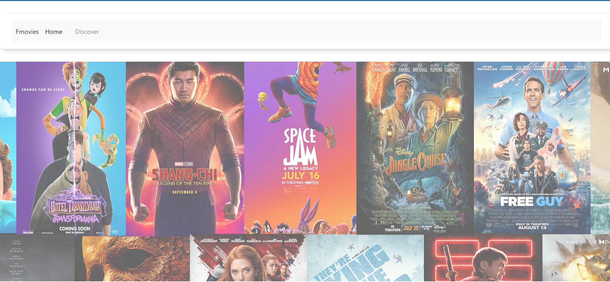
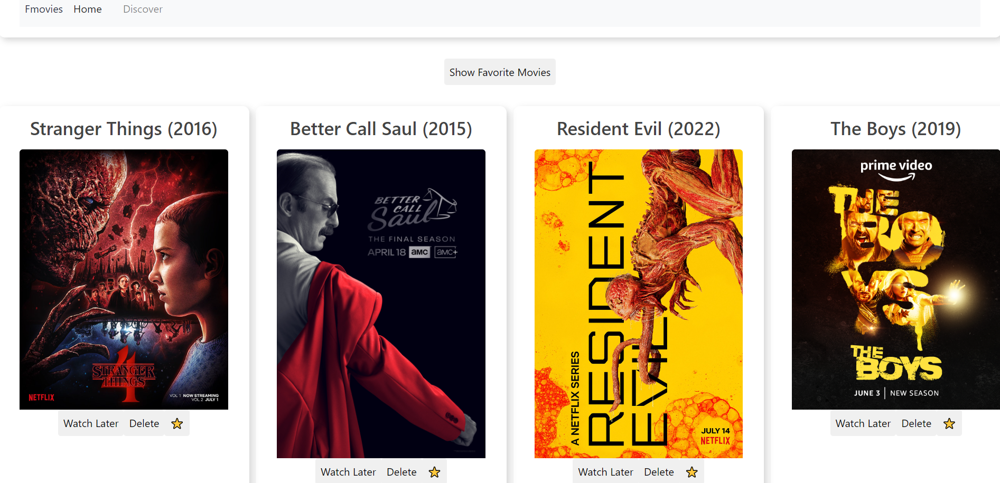
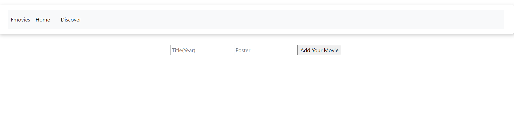

# Welcome to Fmovies Lib! 
## Your one home of entertainment.
#### This is a web application designed using HTML, CSS, JS, Bootstrap, allowing users to bookmark their favorite movies and tv shows for later reference.

## Link to Deployed Site

[Fmovie Lib](https://fmovies-lib.herokuapp.com)

## Table of Contents
  * [Motivation and Technologies](#motivation)
  * [Functionality](#functionality)
  * [Usage](#usage)

## Motivation

The aim of this project was to deliver an app that:
 
*Has at least 5 components
*Has at least 3 client-side routes using react-router
*Uses a json-server to create a RESTful API for your backend and make both a GET and a POST request to the json server.
*Is deployed to Heroku

#### Technologies
* HTML
* CSS 
* JavaScript
* Bootstrap

## Functionality

#### The demo shows the main functions of Fmovies Lib:
* The landing page itroduces the user to the app and gives the app some character while also hosting links to other parts of the app.
* When the user selects the home button they will be directed to their collection of stored movies where they will also have the option to favorite a movie or delete it from     the database entirely.. 
* On the discover route the user is presented with a for to add new content to his library by adding both a title release year and an image of the movie which is updated to the database.  
* The new movie is now updated at the bottom of the database which also helps the user in sorting the movies from old to new especially when clearing up the library. 

## Usage
* View the movies stored in your library as a refrence point. 
* Favorite movies in your library to help sort out your viewing list.
* Delete movies from your library to remove movies you already watched or dont intend to watch.
* Add new content to your viewing list.

## Future Development
* Add a searchbar that connects to an external API the enables you to add to the library making the discover page more user friendly.
* Add a randomizer to help select between may of the great options the user already has in store.
* Add a categories page to help sort out the movies and make the decision making process easier.